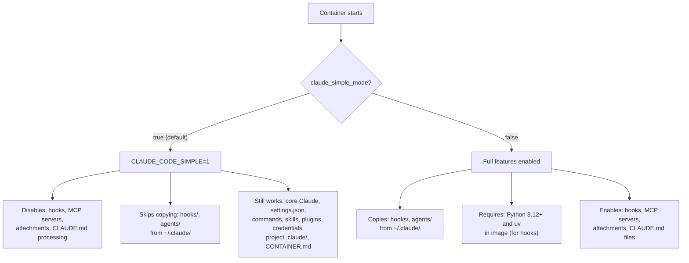

# Configuration

All build-time and runtime configuration lives in `container-build.toml`. The file is read by `launch.sh --rebuild` (for build args) and at every `launch.sh` invocation (for runtime flags).

## container-build.toml

Full annotated example (current defaults):

```toml
[versions]
claude_code = "latest"          # Claude Code binary — "latest" resolves at build time
claude_agent_acp = "latest"     # ACP binary version (only if installed)
gh = "2.87.3"                   # GitHub CLI
fd = "10.3.0"                   # fd-find
python = "3.14"                 # Python version (Python image only)
go = "1.26.0"                   # Go version (Go image only)
golangci_lint = "v2.4.0"        # golangci-lint (Go image only)

[features]
claude_simple_mode = true       # Lean runtime — see Simple Mode below
skip_permissions = "yolo"       # Permission mode — see Permission Modes below
install_claude_agent_acp = false # Install ACP binary (for Zed integration)
```

### [versions] — Tool Versions

| Key | Default | Description |
| --- | --- | --- |
| `claude_code` | `latest` | Claude Code binary version |
| `claude_agent_acp` | `latest` | ACP binary version |
| `gh` | `2.87.3` | GitHub CLI version |
| `fd` | `10.3.0` | fd-find version |
| `python` | `3.14` | Python version (Python image only) |
| `go` | `1.26.0` | Go version (Go image only) |
| `golangci_lint` | `v2.4.0` | golangci-lint version (Go image only) |

Version changes require a rebuild (`./launch.sh --rebuild`).

### [features] — Runtime Feature Flags

Feature flags are read at every `launch.sh` invocation — no rebuild required unless noted.

---

#### `claude_simple_mode`

**Default:** `true`

Sets `CLAUDE_CODE_SIMPLE=1` at container runtime. This is a Claude Code built-in flag that creates a leaner session.



**Why default ON:** The Go image has no Python/uv, which hooks require. Rather than adding Python to every image, simple mode avoids startup errors.

**What still works in simple mode:**
- All core Claude Code functionality (code reading, editing, terminal, git)
- `settings.json`, commands, skills, plugins (copied from `~/.claude/`)
- Project-local `.claude/` directory (copied with workspace)
- Credentials, SSH keys, GitHub token
- `CONTAINER.md` generation

**To disable simple mode:**

1. Set `claude_simple_mode = false` in `container-build.toml`
2. Ensure the image has Python 3.12+ and uv (the Python image already does)
3. Configure MCP servers in `settings.json` if needed
4. No rebuild required — this is a runtime flag

---

#### `skip_permissions`

**Default:** `"yolo"`

Controls how Claude handles permission prompts inside the container.

```mermaid
flowchart TD
    Start["launch.sh reads skip_permissions"] --> Mode{"Value?"}

    Mode -->|'"yolo" (default)'| Yolo["--dangerously-skip-permissions"]
    Mode -->|'"plan"'| Plan["--permission-mode plan<br/>--allow-dangerously-skip-permissions"]
    Mode -->|"false"| Off["No special flags"]

    Yolo --> Y1["Skip all prompts<br/>Full autonomy"]
    Plan --> P1["Start in plan mode<br/>Claude can propose escalation"]
    Off --> O1["Normal interactive prompts<br/>User confirms each action"]
```

| Value | Claude flags | Behavior |
| --- | --- | --- |
| `"yolo"` | `--dangerously-skip-permissions` | Skip all prompts, full autonomy |
| `"plan"` | `--permission-mode plan --allow-dangerously-skip-permissions` | Start in plan mode; Claude can propose escalation |
| `false` | *(none)* | Normal interactive prompts |

**Why "yolo" is safe:** The container is ephemeral and isolated. Changes stay inside unless you explicitly push via git. There is no risk to the host filesystem in copy mode (default).

---

#### `install_claude_agent_acp`

**Default:** `false`

Install the `claude-agent-acp` binary for Zed ACP integration. Adds ~50MB to the image. Requires a rebuild.

> **Note:** Zed ACP mode is currently not operational. Keep this `false` unless you are actively developing the ACP integration.

## container-run.toml — Per-Project Runtime Resources

Place a `container-run.toml` file in your **project directory** to configure the container VM resources. This is separate from `container-build.toml` (which lives with the Container repo) because different projects have different resource needs.

```toml
[resources]
memory = "4g"    # Memory for the container VM (e.g., "2g", "8g", "512m")
cpus = 4         # Number of CPUs for the container VM
```

A template is provided at `container-run.example.toml`.

### Resolution order (highest priority wins)

1. **CLI flags:** `--memory 8g --cpus 8`
2. **Per-project config:** `$PROJECT/container-run.toml` `[resources]`
3. **Defaults:** `memory = "2g"`, `cpus = 4`

Override the config file path with `CONTAINER_RUN_CONFIG=/path/to/config.toml`.

### When to increase resources

- **Go compilation:** Set `memory = "4g"` or higher — Go builds are memory-hungry
- **Large codebases:** More CPUs speed up parallel builds and tests
- **AI/ML workloads:** May need 8g+ for model loading

## CONTAINER.md Templates

At startup, `entrypoint.sh` renders a `CONTAINER.md` file from templates in the `templates/` directory. This file tells Claude about the container environment (Linux arm64, available tools, language-specific guidance).

### Template files

| Template | Used when |
| --- | --- |
| `templates/CONTAINER.python.md.tmpl` | Python image (default) |
| `templates/CONTAINER.golang.md.tmpl` | Go image (when `go` is in PATH) |

### Placeholders

Templates support variable substitution:

| Placeholder | Resolved from |
| --- | --- |
| `{{PYTHON_VERSION}}` | `python3 --version` |
| `{{GO_VERSION}}` | `go version` |
| `{{GOLANGCI_LINT_VERSION}}` | `golangci-lint version` |
| `{{CLAUDE_VERSION}}` | Stored version file or `claude --version` |

### Conditional blocks

Templates support conditional sections using pseudo-XML:

```
<if HAS_ACP>
claude-agent-acp is available at /home/sandbox/.local/bin/claude-agent-acp
</if>

<if HAS_GOLANGCI_CONFIG>
Host ~/.golangci.yml was copied to /home/sandbox/.
</if>
```

Negate with `!`:

```
<if !HAS_ACP>
ACP is not installed.
</if>
```

Available conditions: `HAS_ACP`, `HAS_GOLANGCI_CONFIG`.

### Making Claude read CONTAINER.md

To ensure Claude reads the container context, add this to your project's `CLAUDE.md`:

```markdown
# Container Environment

./CONTAINER.md
```

## System Prompt Injection

`launch.sh` automatically appends a system prompt to every Claude session:

```
You MUST read CONTAINER.md in the workspace root before doing anything else.
```

This is injected via the `--append-system-prompt` flag, ensuring Claude reads the container environment documentation regardless of whether `CLAUDE.md` references it.
