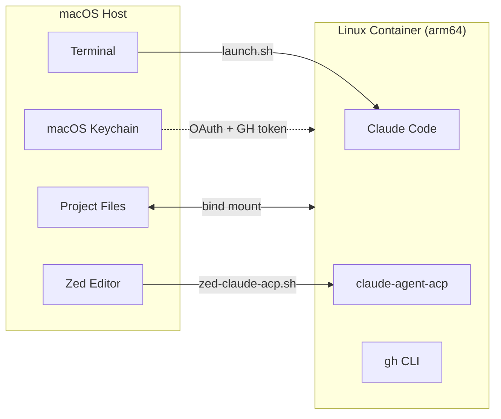
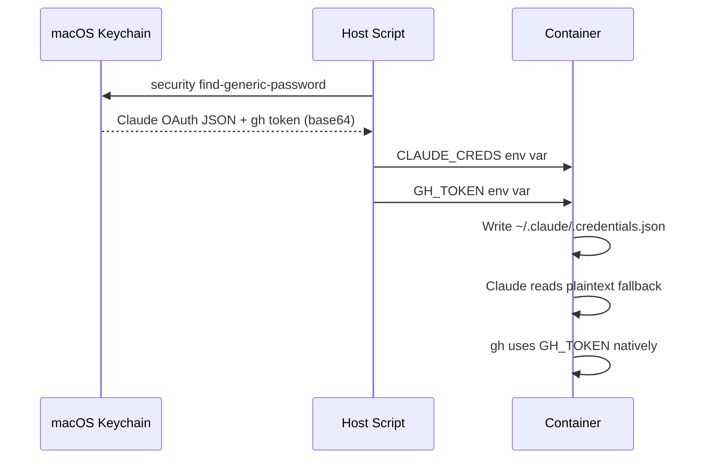
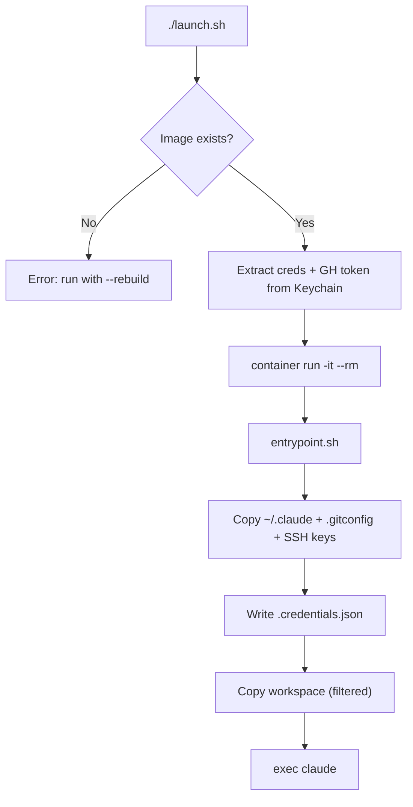
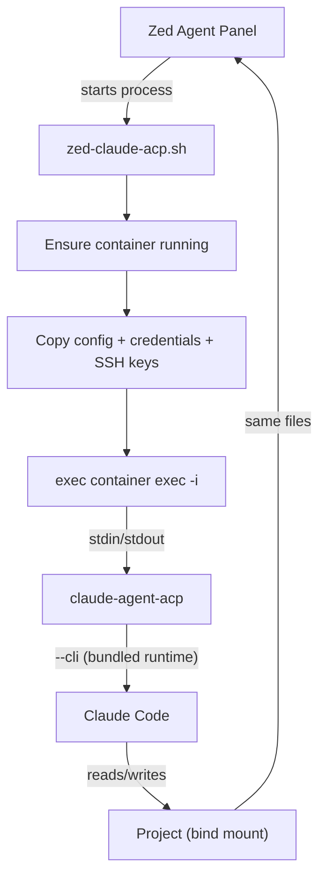
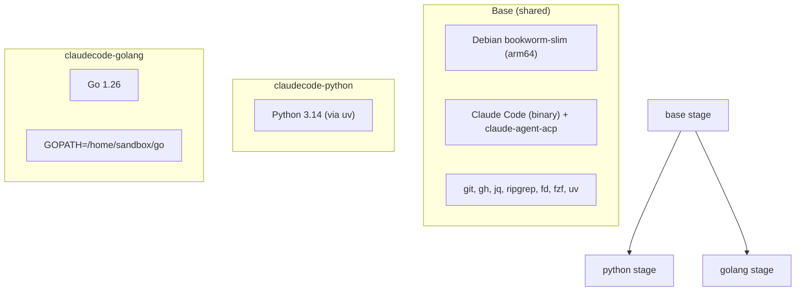
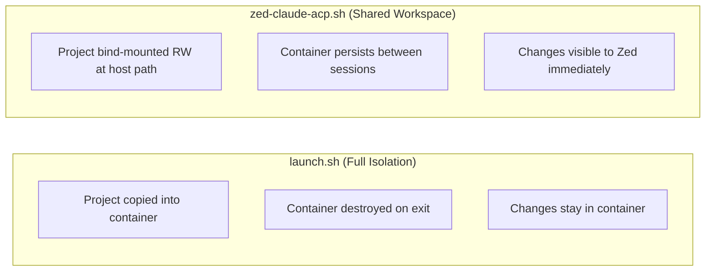
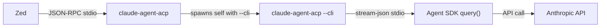
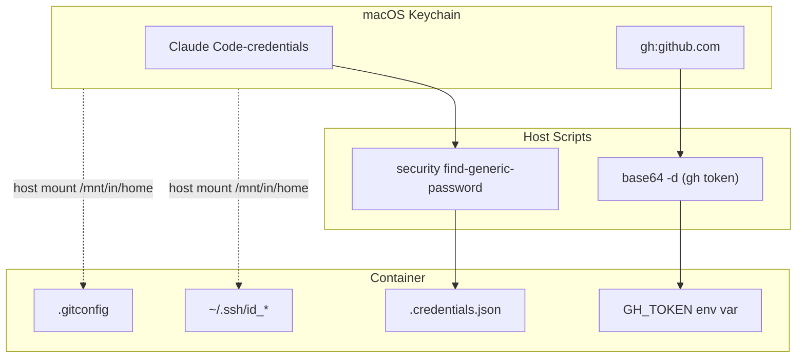

# Claude Code Container

Run Claude Code inside a sandboxed Linux container on macOS. Two modes: interactive terminal sessions and Zed editor integration via ACP.



## Prerequisites

- macOS with Apple Silicon
- Apple's [`container`](https://github.com/apple/container-manager) CLI
- Claude Code authenticated on host (`claude login`)
- GitHub CLI authenticated on host (`gh auth login`) — optional, for git push/PR workflows

## Quick Start

```bash
# Build the Python image (first time only)
./launch.sh --rebuild

# Run Claude Code interactively
./launch.sh

# Run on a specific project
./launch.sh -C /path/to/project

# Build and run with Go image
./launch.sh --rebuild --lang golang
./launch.sh --lang golang

# Pass arguments to claude
./launch.sh -- --version
```

## Files

| File | Purpose |
|------|---------|
| `Dockerfile` | Multi-target image: base + Python or Go |
| `entrypoint.sh` | Container startup: copies config, credentials, SSH keys, workspace |
| `launch.sh` | Interactive mode: ephemeral container with full isolation |
| `zed-claude-acp.sh` | Zed ACP mode: persistent container with stdio bridge |
| `cleanup.sh` | Manage containers and images (list/stop/remove/prune) |
| `CONTAINER.md` | Auto-generated in project dir; tells Claude it's in a Linux container |
| `.dockerignore` | Limits build context to Dockerfile + entrypoint.sh |

## How It Works

### Authentication Bridge

Both Claude Code OAuth and GitHub CLI tokens live in macOS Keychain. The scripts extract them and inject into the container — Claude credentials as a plaintext fallback file, GitHub token as `GH_TOKEN` env var.



SSH keys (`~/.ssh/id_*`) and `.gitconfig` are also copied from the host mount, with `github.com` added to `known_hosts` via `ssh-keyscan`.

### Mode 1: Interactive (`launch.sh`)

Ephemeral container. Project is copied into the container (with build artifact filtering) for full isolation. Container is removed on exit.



| Flag | Description |
|------|-------------|
| `--rebuild` | Build/rebuild the container image |
| `-C, --project PATH` | Project directory (default: `$PWD`) |
| `--lang LANG` | Language target: `python` (default) or `golang` |
| `--rw` | Mount workspace read-write (no isolation) |
| `--update-claude` | Allow Claude to auto-update in container |
| `-- ARGS...` | Pass arguments to claude |

| Variable | Default | Description |
|----------|---------|-------------|
| `CONTAINER_LANG` | `python` | Language target |
| `BUILD_CPUS` | 2 | CPUs for image builder |
| `BUILD_MEMORY` | 4g | Memory for image builder |

### Mode 2: Zed ACP (`zed-claude-acp.sh`)

Persistent container per project. Zed connects via ACP (Agent Client Protocol) over stdio. Project is bind-mounted read-write at its original host path so Zed sees all changes immediately.



**Zed configuration** (`~/.config/zed/settings.json`):

```json
{
  "agent_servers": {
    "Containerized Claude": {
      "type": "custom",
      "command": "/path/to/Container/zed-claude-acp.sh",
      "env": {
        "ANTHROPIC_BASE_URL": "https://your-proxy.example.com",
        "API_TIMEOUT_MS": "6000000",
        "CLAUDE_CODE_DISABLE_NONESSENTIAL_TRAFFIC": "1",
        "CLAUDE_CODE_SIMPLE": "1",
        "DISABLE_NON_ESSENTIAL_MODEL_CALLS": "1"
      }
    }
  }
}
```

Environment variables set in Zed's `env` block are automatically forwarded into the container.

**Log file:** `/tmp/zed-claude-acp.log`

**Container TTL:** Containers auto-stop after 30 minutes of idle (no active `claude-agent-acp` process). Override with `CONTAINER_TTL` env var:

```bash
CONTAINER_TTL=3600    # 1 hour
CONTAINER_TTL=0       # never auto-stop
```

### Container Cleanup

```bash
./cleanup.sh                       # List all containers
./cleanup.sh --stop zed-myproject  # Stop one container
./cleanup.sh --stop                # Stop all
./cleanup.sh --remove              # Delete all stopped
./cleanup.sh --prune               # Stop + delete everything
./cleanup.sh --images              # List images
./cleanup.sh --images --prune      # Delete all images
```

## Container Images

Multi-target Dockerfile with a shared base and language-specific stages:



| Image | Build command |
|-------|-------------|
| `claudecode-python` | `./launch.sh --rebuild` |
| `claudecode-golang` | `./launch.sh --rebuild --lang golang` |

### Base tooling (both images)

- Claude Code (latest, direct binary from GCS — no Bun/npm)
- claude-agent-acp v0.19.2
- GitHub CLI (gh) v2.87.3
- uv (Python package manager)
- git, jq, ripgrep, fd-find, fzf, openssh-client
- Non-root `sandbox` user

### Workspace Copy Filtering

In copy mode (default for `launch.sh`), the entrypoint filters out build artifacts and IDE files to reduce copy size and avoid macOS/Linux incompatibilities:

**Excluded:** `.venv/`, `venv/`, `node_modules/`, `__pycache__/`, `*.pyc`, `.DS_Store`, `.ruff_cache/`, `.mypy_cache/`, `.pytest_cache/`, `.fastembed_cache/`, `.vscode/`, `.github/`, `.codex/`, `.codanna/`

**Kept:** source code, `.git/`, `.claude/` (CLAUDE.md), `.mcp.json`, `.env`, docs

## Architecture

### Isolation Model



| | `launch.sh` | `zed-claude-acp.sh` |
|---|---|---|
| Container name | `claude-<project>` | `zed-<project>` |
| Image | `claudecode-<lang>` | `claudecode-<lang>` |
| Lifecycle | Ephemeral (`--rm`) | Persistent (30 min idle TTL) |
| Workspace | Copied (filtered, isolated) | Bind-mounted RW at host path |
| Interaction | Interactive terminal | Zed Agent Panel via ACP |
| Host changes | Only with `--rw` | Always |

### Cross-Platform Awareness (`CONTAINER.md`)

The container runs Linux arm64 but the host is macOS. This causes cross-platform issues:

- **Python `.venv/`** created on macOS contains Mach-O binaries — unusable in the Linux container
- **Go binaries** built inside the container are Linux ELF — won't run on macOS
- **C extensions** (`.so` files) are platform-specific

Both scripts auto-generate a `CONTAINER.md` file in the project directory at startup. To make Claude aware of the container environment, add this to your project's `CLAUDE.md`:

```markdown
# Container Environment

./CONTAINER.md
```

The generated file tells Claude:
- It's running in a Linux arm64 container, not macOS
- How to create a Linux-native Python venv (instead of using the macOS `.venv/`)
- How to handle Go build artifacts to avoid cross-platform conflicts

`launch.sh` generates it inside `/workspace` (isolated copy). `zed-claude-acp.sh` generates it in the host project directory (bind mount) — add `CONTAINER.md` to `.gitignore`.

### ACP Runtime

The `claude-agent-acp` binary is self-contained — it bundles its own Claude Code runtime and spawns itself with `--cli` for SDK queries. **Do not set `CLAUDE_CODE_EXECUTABLE`** when using ACP; doing so overrides the bundled runtime and breaks the `--cli` handshake.



### Credential Flow



## Troubleshooting

**"Not logged in" inside container**
- Verify host login: `claude login`
- Check Keychain: `security find-generic-password -s "Claude Code-credentials" -w | jq .`

**"Image not found"**
- Build first: `./launch.sh --rebuild`

**Build OOM ("cannot allocate memory")**
- Increase builder memory: `BUILD_MEMORY=12g ./launch.sh --rebuild`
- Claude Code is installed as a direct binary download (no compilation), so OOM is unlikely unless the builder is severely memory-constrained

**"Query closed before response received" in Zed**
- Ensure `CLAUDE_CODE_EXECUTABLE` is **not** set in Zed's env block
- Check ACP logs: `tail -f /tmp/zed-claude-acp.log`
- Verify container: `./cleanup.sh`

**401 "invalid x-api-key" errors**
- Your project's `.env` file likely contains `ANTHROPIC_API_KEY`. Claude Code autoloads `.env` from the working directory, overriding OAuth authentication with an invalid/stale API key.
- Both scripts set `ANTHROPIC_API_KEY=` (empty) in the container environment to prevent this. Bun won't override an existing env var from `.env`.

**ACP not connecting in Zed**
- Check logs: `tail -f /tmp/zed-claude-acp.log`
- Zed command palette: `dev: open acp logs`
- Verify container: `./cleanup.sh`

**GitHub push/PR not working inside container**
- Verify `gh auth status` on host
- Check SSH key: `ssh -T git@github.com` inside container
- Ensure `gh:github.com` entry exists in Keychain: `security find-generic-password -s "gh:github.com"`

**Container system not running**
- Start the runtime: `container system start`
