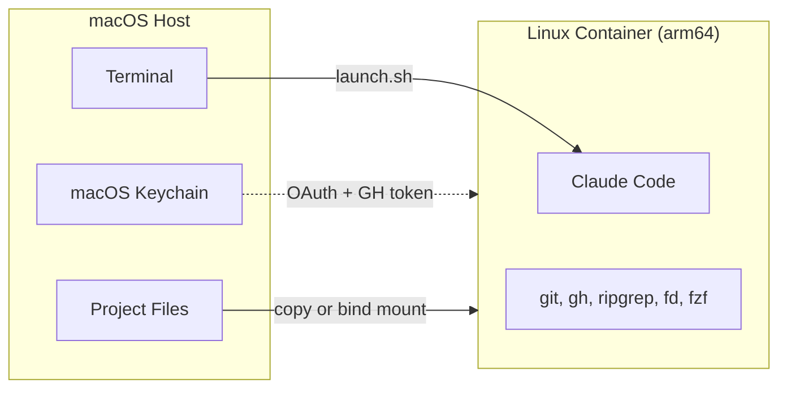
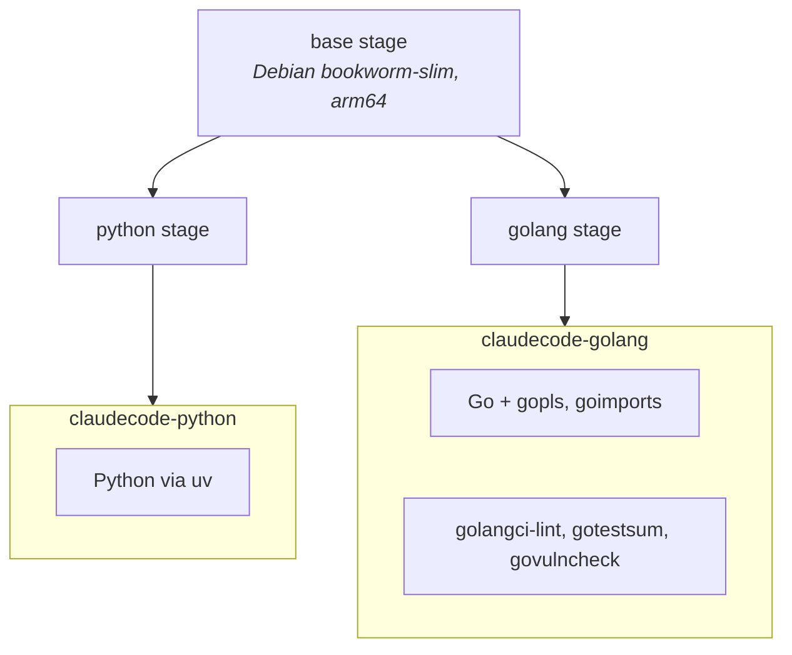

# Claude Code Container

Run Claude Code inside a sandboxed Linux container on macOS — full isolation, ephemeral by default, credentials bridged automatically from Keychain.



## Prerequisites

- macOS with Apple Silicon
- Apple's [`container`](https://github.com/apple/container-manager) CLI
- Claude Code authenticated on host (`claude login`)
- GitHub CLI authenticated on host (`gh auth login`) — optional, for git push/PR workflows

## Quick Start

```bash
./launch.sh --rebuild          # Build image (first time)
./launch.sh                    # Run Claude Code interactively
./launch.sh -C /path/to/project  # Run on a specific project
./launch.sh --rebuild --lang golang  # Build Go image
```

## Documentation

| Document | What's inside |
| --- | --- |
| [CONFIGURATION.md](CONFIGURATION.md) | Build config, feature flags, permission modes, simple mode, templates |
| [RUNNING.md](RUNNING.md) | Building images, running containers, workspace isolation, cleanup |

## Files

| File | Purpose |
| --- | --- |
| `Dockerfile` | Multi-target image: base + Python or Go |
| `entrypoint.sh` | Container startup: copies config, credentials, SSH keys, workspace |
| `launch.sh` | Interactive mode: ephemeral container with full isolation |
| `zed-claude-acp.sh` | Zed ACP mode (not operational — see below) |
| `cleanup.sh` | Manage containers and images (list/stop/remove/prune) |
| `container-build.toml` | Build-time versions and feature flags |
| `templates/CONTAINER.*.md.tmpl` | Language-specific CONTAINER.md templates |
| `CONTAINER.md` | Auto-generated at runtime; tells Claude it's in a Linux container |
| `.dockerignore` | Limits build context to Dockerfile + entrypoint + templates |

## Container Images

Multi-target Dockerfile with a shared base and language-specific stages:



**Base tooling (both images):** Claude Code (binary), git, gh, jq, ripgrep, fd, fzf, uv, openssh-client. Non-root `sandbox` user.

| Image | Build command |
| --- | --- |
| `claudecode-python` | `./launch.sh --rebuild` |
| `claudecode-golang` | `./launch.sh --rebuild --lang golang` |

## Zed ACP Mode (On Hold)

> **Blocked by upstream bug in `claude-agent-acp` v0.20.1 static binary (linux-arm64).**
>
> The ACP static binary (Bun SEA) crashes with a JavaScript TDZ error (`Cannot access 'z4' before initialization`) during `session/prompt`. The bug is in the binary's `--cli` mode — a code path used only by the static build. The Homebrew (Node.js) distribution of the same version works fine on macOS because it uses the SDK's `cli.js` module directly instead of `--cli`.
>
> `zed-claude-acp.sh` itself is correct and ready — it's waiting for a fixed ACP binary. Track the issue at [zed-industries/claude-agent-acp](https://github.com/zed-industries/claude-agent-acp/issues).

## Troubleshooting

**"Not logged in" inside container**

- Verify host login: `claude login`
- Check Keychain: `security find-generic-password -s "Claude Code-credentials" -w | jq .`

**"Image not found"**

- Build first: `./launch.sh --rebuild`

**Build OOM ("cannot allocate memory")**

- Increase builder memory: `BUILD_MEMORY=12g ./launch.sh --rebuild`

**401 "invalid x-api-key" errors**

- Your project's `.env` file likely contains `ANTHROPIC_API_KEY`. Claude Code autoloads `.env`, overriding OAuth with a stale key.
- Both scripts set `ANTHROPIC_API_KEY=` (empty) to prevent this.

**GitHub push/PR not working inside container**

- Verify `gh auth status` on host
- Check SSH key: `ssh -T git@github.com` inside container
- Ensure `gh:github.com` entry exists in Keychain: `security find-generic-password -s "gh:github.com"`

**Container system not running**

- Start the runtime: `container system start`

**"Query closed before response received" in Zed**

- Ensure `CLAUDE_CODE_EXECUTABLE` is **not** set in Zed's env block
- Check ACP logs: `tail -f /tmp/zed-claude-acp.log`
