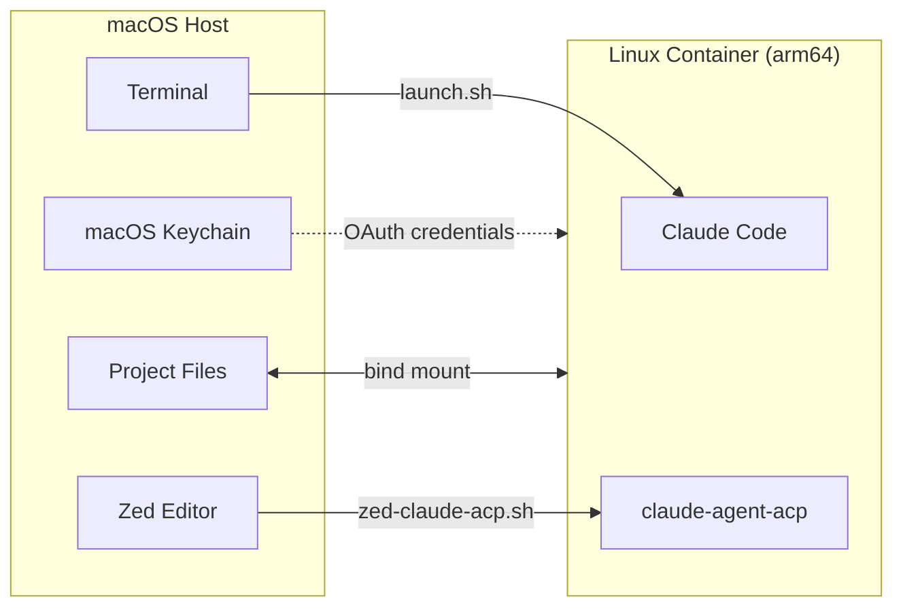
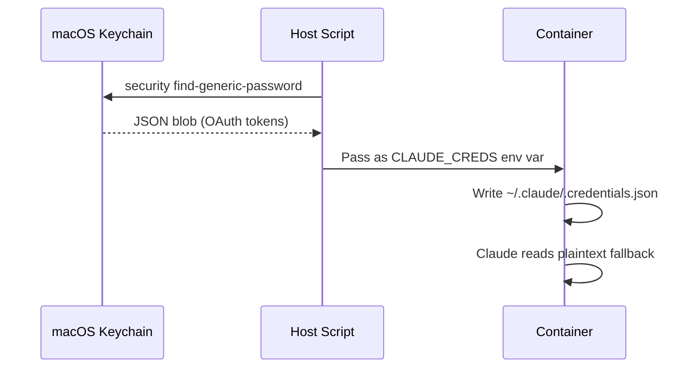
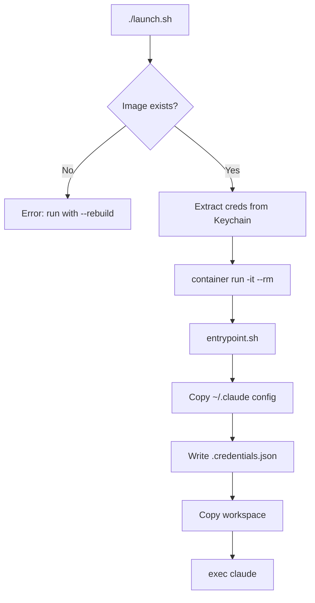
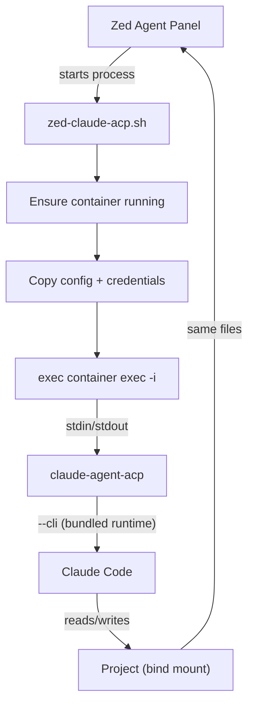
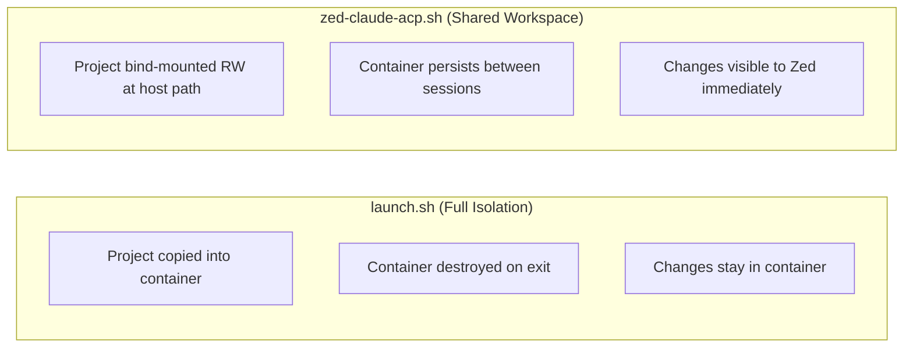
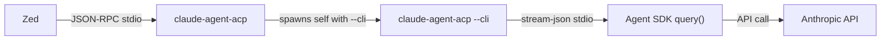

# Claude Code Container

Run Claude Code inside a sandboxed Linux container on macOS. Two modes: interactive terminal sessions and Zed editor integration via ACP.



## Prerequisites

- macOS with Apple Silicon
- Apple's [`container`](https://github.com/apple/container-manager) CLI (ships with OrbStack, or install standalone)
- Claude Code authenticated on host (`claude login`)

## Quick Start

```bash
# Build the container image (first time only)
./launch.sh --rebuild

# Run Claude Code interactively
./launch.sh

# Run on a specific project
./launch.sh -C /path/to/project

# Pass arguments to claude
./launch.sh -- --version
```

## Files

| File | Purpose |
|------|---------|
| `Dockerfile` | Container image: Debian bookworm-slim + Claude Code + claude-agent-acp |
| `entrypoint.sh` | Container entrypoint: copies config, writes credentials, launches claude |
| `launch.sh` | Interactive mode: ephemeral container with full isolation |
| `zed-claude-acp.sh` | Zed ACP mode: persistent container with stdio bridge |
| `cleanup.sh` | Manage containers and images (list/stop/remove/prune) |

## How It Works

### Authentication Bridge

macOS stores Claude Code OAuth tokens in Keychain. Linux containers have no Keychain, so the scripts extract the credential blob and write it as `~/.claude/.credentials.json` inside the container (the Linux plaintext fallback).



### Mode 1: Interactive (`launch.sh`)

Ephemeral container. Project is copied into the container for full isolation. Container is removed on exit.



| Flag | Description |
|------|-------------|
| `--rebuild` | Build/rebuild the container image |
| `-C, --project PATH` | Project directory (default: `$PWD`) |
| `--rw` | Mount workspace read-write (no isolation) |
| `--update-claude` | Allow Claude to auto-update in container |
| `-- ARGS...` | Pass arguments to claude |

| Variable | Default | Description |
|----------|---------|-------------|
| `BUILD_CPUS` | 4 | CPUs for image builder |
| `BUILD_MEMORY` | 12g | Memory for image builder |

### Mode 2: Zed ACP (`zed-claude-acp.sh`)

Persistent container per project. Zed connects via ACP (Agent Client Protocol) over stdio. Project is bind-mounted read-write at its original host path so Zed sees all changes immediately.



**Zed configuration** (`~/.config/zed/settings.json`):

```json
{
  "agent_servers": {
    "Containerized Claude": {
      "type": "custom",
      "command": "/path/to/Container/zed-claude-acp.sh",
      "env": {
        "ANTHROPIC_BASE_URL": "https://your-proxy.example.com",
        "API_TIMEOUT_MS": "6000000",
        "CLAUDE_CODE_DISABLE_NONESSENTIAL_TRAFFIC": "1",
        "CLAUDE_CODE_SIMPLE": "1",
        "DISABLE_NON_ESSENTIAL_MODEL_CALLS": "1"
      }
    }
  }
}
```

Environment variables set in Zed's `env` block are automatically forwarded into the container.

**Log file:** `/tmp/zed-claude-acp.log`

**Container TTL:** Containers auto-stop after 30 minutes of idle (no active `claude-agent-acp` process). Override with `CONTAINER_TTL` env var:

```bash
CONTAINER_TTL=3600    # 1 hour
CONTAINER_TTL=0       # never auto-stop
```

### Container Cleanup

```bash
./cleanup.sh                       # List all containers
./cleanup.sh --stop zed-myproject  # Stop one container
./cleanup.sh --stop                # Stop all
./cleanup.sh --remove              # Delete all stopped
./cleanup.sh --prune               # Stop + delete everything
./cleanup.sh --images              # List images
./cleanup.sh --images --prune      # Delete all images
```

## Container Image

Debian bookworm-slim (arm64) with:

- Claude Code (latest via official installer)
- claude-agent-acp v0.19.2 (static binary, bundles its own Claude Code runtime)
- Python 3, uv, git, jq, ripgrep, fd-find, fzf
- Non-root `sandbox` user

Rebuild: `./launch.sh --rebuild`

## Architecture

### Isolation Model



| | `launch.sh` | `zed-claude-acp.sh` |
|---|---|---|
| Container name | `claude-<project>` | `zed-<project>` |
| Lifecycle | Ephemeral (`--rm`) | Persistent (30 min idle TTL) |
| Workspace | Copied (isolated) | Bind-mounted RW at host path |
| Interaction | Interactive terminal | Zed Agent Panel via ACP |
| Host changes | Only with `--rw` | Always |

### ACP Runtime

The `claude-agent-acp` binary is self-contained — it bundles its own Claude Code runtime and spawns itself with `--cli` for SDK queries. **Do not set `CLAUDE_CODE_EXECUTABLE`** when using ACP; doing so overrides the bundled runtime and breaks the `--cli` handshake.



## Troubleshooting

**"Not logged in" inside container**
- Verify host login: `claude login`
- Check Keychain: `security find-generic-password -s "Claude Code-credentials" -w | jq .`

**"Image not found"**
- Build first: `./launch.sh --rebuild`

**"Query closed before response received" in Zed**
- Ensure `CLAUDE_CODE_EXECUTABLE` is **not** set in Zed's env block
- Check ACP logs: `tail -f /tmp/zed-claude-acp.log`
- Verify container: `./cleanup.sh`

**401 "invalid x-api-key" errors (ACP returns no response)**
- Your project's `.env` file likely contains `ANTHROPIC_API_KEY`. Claude Code loads `.env` from the working directory, overriding OAuth authentication with an invalid/stale API key.
- `zed-claude-acp.sh` already sets `ANTHROPIC_API_KEY=` (empty) in the container exec environment to prevent this. If you see this error, check that the empty override is still in `EXEC_ENV`.

**ACP not connecting in Zed**
- Check logs: `tail -f /tmp/zed-claude-acp.log`
- Zed command palette: `dev: open acp logs`
- Verify container: `./cleanup.sh`

**Container system not running**
- Start the runtime: `container system start`
