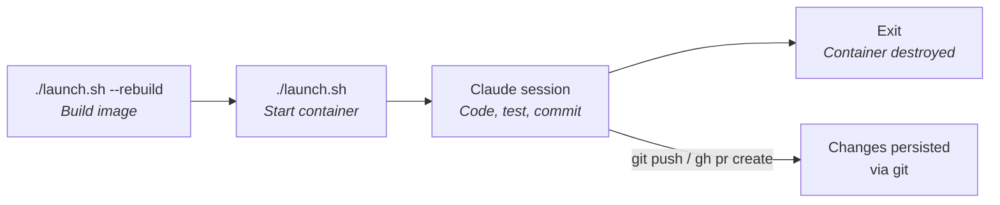
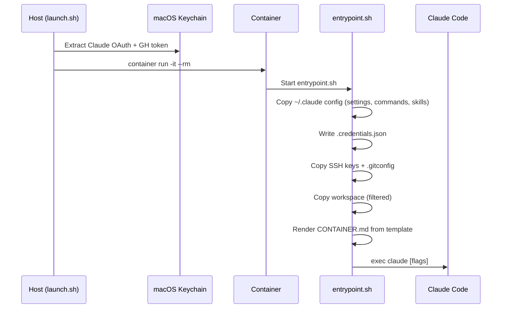
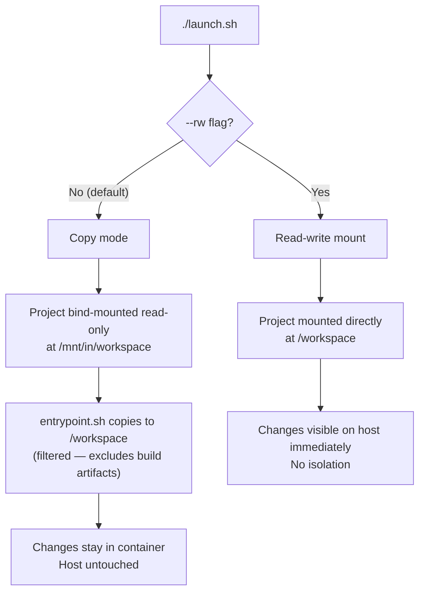
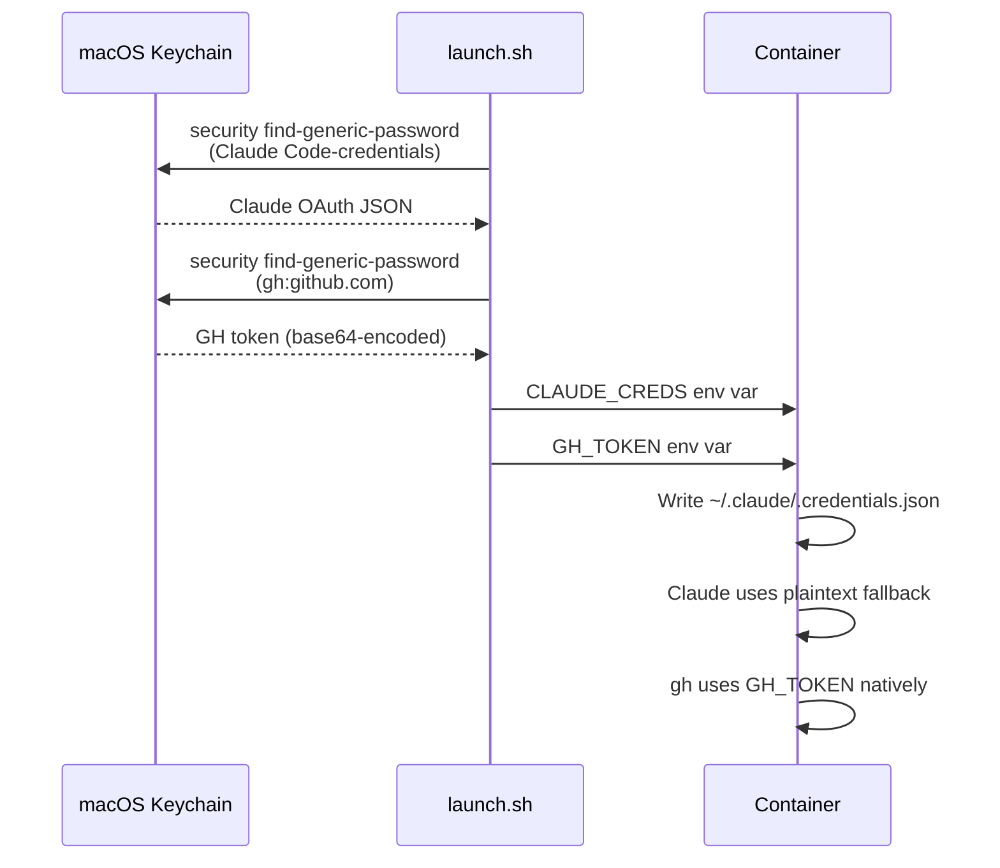

# Running Claude Code Containers

## Overview



Containers are ephemeral by default — all local changes are lost on exit. Push via git to persist work.

## Building Images

### First Build

```bash
# Python image (default)
./launch.sh --rebuild

# Go image
./launch.sh --rebuild --lang golang
```

### When to Rebuild

- After changing tool versions in `container-build.toml` (`[versions]` section)
- After toggling `install_claude_agent_acp`
- To pick up a new Claude Code binary (`claude_code = "latest"` resolves at build time)

Feature flags (`claude_simple_mode`, `skip_permissions`) are runtime — no rebuild needed.

### Builder Resources

The Apple `container` builder has limited defaults. Override if builds are slow or OOM:

| Variable | Default | Description |
| --- | --- | --- |
| `BUILD_CPUS` | `2` | CPUs allocated to builder |
| `BUILD_MEMORY` | `4g` | Memory allocated to builder |

```bash
BUILD_CPUS=4 BUILD_MEMORY=8g ./launch.sh --rebuild
```

## Interactive Mode (`launch.sh`)

### How It Works



### Command Reference

| Flag | Description |
| --- | --- |
| `--rebuild` | Build/rebuild the container image before running |
| `-C, --project PATH` | Project directory (default: `$PWD`) |
| `--lang LANG` | Language target: `python` (default) or `golang` |
| `--rw` | Mount workspace read-write (no isolation) |
| `--update-claude` | Allow Claude to auto-update inside the container |
| `--config PATH` | Build config path (default: `./container-build.toml`) |
| `-- ARGS...` | Pass remaining arguments to claude |

### Environment Variables

| Variable | Default | Description |
| --- | --- | --- |
| `CONTAINER_LANG` | `python` | Language target |
| `BUILD_CPUS` | `2` | CPUs for image builder |
| `BUILD_MEMORY` | `4g` | Memory for image builder |
| `CONTAINER_BUILD_CONFIG` | `./container-build.toml` | Build config path override |
| `CLAUDE_CODE_SIMPLE` | `1` (from config) | Simple mode flag (see [CONFIGURATION.md](CONFIGURATION.md#claude_simple_mode)) |

### Workspace Isolation



**Copy mode** (default) filters out build artifacts and IDE files to reduce copy size and avoid macOS/Linux incompatibilities:

**Excluded:** `.venv/`, `venv/`, `node_modules/`, `__pycache__/`, `*.pyc`, `.DS_Store`, `.ruff_cache/`, `.mypy_cache/`, `.pytest_cache/`, `.fastembed_cache/`, `.vscode/`, `.github/`, `.codex/`, `.codanna/`, `bin/linux`

**Kept:** source code, `.git/`, `.claude/`, `.mcp.json`, `.env`, docs

### Authentication Bridge



Additionally, SSH keys (`~/.ssh/id_*`) and `.gitconfig` are copied from the host mount. `github.com` is added to `known_hosts` via `ssh-keyscan`.

`ANTHROPIC_API_KEY` is set to empty string in the container to prevent `.env` files from overriding OAuth authentication.

### Cross-Platform Awareness

The container runs Linux arm64 but the host is macOS. This causes cross-platform issues:

- **Python `.venv/`** created on macOS contains Mach-O binaries — unusable in Linux
- **Go binaries** built inside the container are Linux ELF — won't run on macOS
- **C extensions** (`.so` files) are platform-specific

`CONTAINER.md` is auto-generated from templates at startup to inform Claude about these issues. See [CONFIGURATION.md](CONFIGURATION.md#containermd-templates) for template details.

## Zed ACP Mode (Not Operational)

> **Warning:** Zed ACP integration (`zed-claude-acp.sh`) is currently not operational and will be reworked. The documentation below describes the intended design but should not be relied upon.

**Intended design:** Persistent container per project. Zed connects via ACP (Agent Client Protocol) over stdio. Project is bind-mounted read-write at its original host path so Zed sees changes immediately.

Key differences from interactive mode:

|  | `launch.sh` | `zed-claude-acp.sh` |
| --- | --- | --- |
| Container name | `claude-<project>` | `zed-<project>` |
| Lifecycle | Ephemeral (`--rm`) | Persistent (30 min idle TTL) |
| Workspace | Copied (filtered, isolated) | Bind-mounted RW at host path |
| Interaction | Interactive terminal | Zed Agent Panel via ACP |
| Host changes | Only with `--rw` | Always |

**Container TTL:** Auto-stop after 30 minutes idle (no active `claude-agent-acp` process). Override:

```bash
CONTAINER_TTL=3600    # 1 hour
CONTAINER_TTL=0       # never auto-stop
```

**ACP runtime note:** `claude-agent-acp` bundles its own Claude Code runtime. Do **not** set `CLAUDE_CODE_EXECUTABLE` — it breaks the `--cli` handshake.

**Log file:** `/tmp/zed-claude-acp.log`

## Container Cleanup

The `cleanup.sh` script manages all containers (prefixed `claude-*` and `zed-*`) and images (prefixed `claudecode-*`).

| Command | Description |
| --- | --- |
| `./cleanup.sh` | List all managed containers and status |
| `./cleanup.sh --stop NAME` | Stop a specific container |
| `./cleanup.sh --stop` | Stop all managed containers |
| `./cleanup.sh --remove` | Delete all stopped containers |
| `./cleanup.sh --remove NAME` | Delete a specific stopped container |
| `./cleanup.sh --prune` | Stop and delete all containers |
| `./cleanup.sh --images` | List `claudecode-*` images |
| `./cleanup.sh --images --prune` | Delete all `claudecode-*` images |
