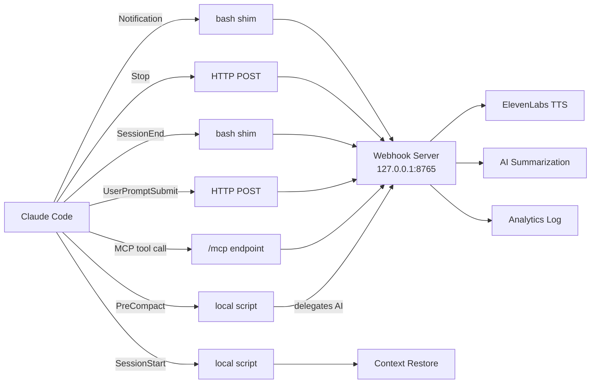
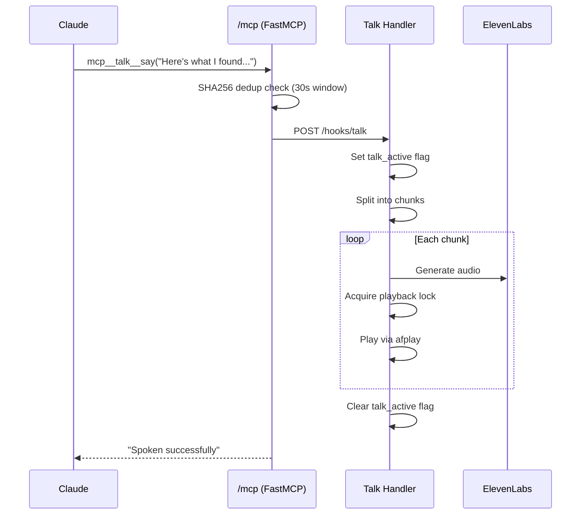
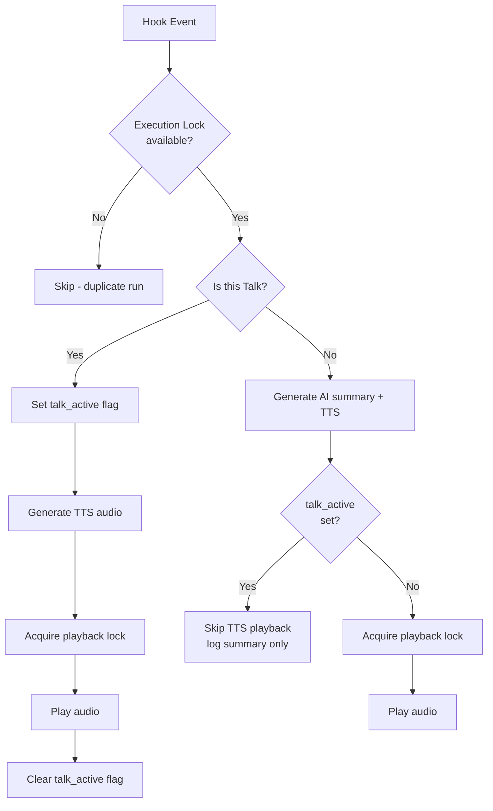

# Architecture

This document covers the design and internals of the Claude Code Hooks Collection. For a quick overview, see the [README](../README.md). For webhook server operations (setup, endpoints, containers), see [`webhook-server/README.md`](../webhook-server/README.md).

## Hook Delivery Model

Claude Code supports [four hook types](https://code.claude.com/docs/en/hooks):

| Type | How it works | When to use |
|------|-------------|-------------|
| **command** | Runs a shell command, passes JSON on stdin | Need transcript access, file embedding, complex logic |
| **http** | POST to a URL with JSON body | Simple event forwarding, lowest latency |
| **prompt** | Injects text into the conversation | Context injection (date, git status) |
| **agent** | Spawns a sub-agent to handle the event | Complex multi-step processing |

This project uses **http** hooks where possible (Stop, prompt-analytics) for simplicity and speed. **Command** hooks (bash shims) are used when the hook needs to read the transcript file and embed its contents in the request body — something HTTP hooks can't do natively.

## Hook Delivery Flow



## Hook Inventory

### Via Webhook Server (Global)

These hooks are registered in `~/.claude/settings.json` and apply to all projects.

**Notification** (command shim)
```json
{ "type": "command", "command": "$HOME/.claude/hooks/notification_webhook.sh" }
```
Reads the notification message from stdin, forwards to `/hooks/notification`, plays TTS audio.

**Stop** (native HTTP)
```json
{ "type": "http", "url": "http://127.0.0.1:8765/hooks/stop", "timeout": 60 }
```
Receives the assistant's last response, generates an AI summary, plays TTS. No shim needed — Claude Code sends the JSON directly.

**SessionEnd** (command shim)
```json
{ "type": "command", "command": "$HOME/.claude/hooks/session_end_webhook.sh" }
```
Reads the transcript file, embeds its content in the request, forwards to `/hooks/session-end`. The server summarizes the full session and plays TTS.

### Via Webhook Server (Project)

Registered in the project's `.claude/settings.json`.

**prompt-analytics** (native HTTP)
```json
{ "type": "http", "url": "http://127.0.0.1:8765/hooks/prompt-analytics", "timeout": 10 }
```
Logs user prompts server-side for analytics. No TTS.

### Local Scripts (Project)

These run as command hooks from the project's `.claude/hooks/` directory.

| Hook | Event | Purpose |
|------|-------|---------|
| `skill-forced-eval.py` | UserPromptSubmit | Forces skill evaluation on every prompt |
| `save_context_precompact.py` | PreCompact | Saves conversation context, delegates AI summarization to the webhook server |
| `restore_context_postcompact.py` | SessionStart (matcher: `compact`) | Restores saved context after compaction |

### Talk (MCP Tool)

Claude speaks to the user via the `mcp__talk__say` MCP tool — a dedicated voice channel separate from automated hook TTS.

- **Why separate?** Talk is deliberate speech initiated by Claude, not automated summaries. It uses a different voice (Josh) to distinguish from hook notifications (James).
- **Registration:** `.mcp.json` points to `http://127.0.0.1:8765/mcp/` where FastMCP exposes the `say` tool.
- **Chunking:** Long messages are split at sentence boundaries (>3 sentences or >500 chars). Sentences over 500 chars are further split at commas, semicolons, colons, and dashes to prevent ElevenLabs truncation.



### Retired Hooks

| Hook | Was | Reason retired |
|------|-----|----------------|
| `date_wrapper.py` | SessionStart (global) | Claude Code now has built-in date/time awareness |
| `grep_check_v2.py` | PreToolUse (global) | Counterproductive — blocks a tool Claude uses well |
| `git_status.py` | SessionStart (project) | Claude Code now has built-in git awareness |
| `codanna_wrapper.py` | SessionStart (project) | More burden than benefit for most sessions |
| `codanna_check.py` | PreToolUse (project) | Removed with codanna_wrapper |

## TTS Collision Prevention

Multiple hooks can trigger TTS simultaneously (e.g., Stop fires while Talk is mid-sentence). A 4-layer hierarchy prevents collisions:



**Layer 1 — Execution locks** (`execution_lock.py`): File-based atomic locks with configurable windows (5-60s). Prevents duplicate hook runs from rapid-fire events.

**Layer 2 — Talk priority** (`tts_lock.py` / `talk_active`): A `threading.Event` flag. When Talk is actively playing, Stop and SessionEnd hooks skip their TTS playback entirely (they still generate and log summaries).

**Layer 3 — Playback serialization** (`tts_lock.py` / `tts_playback_lock`): A `threading.Lock` ensuring only one `afplay` process runs at a time. All TTS handlers acquire this before playing audio.

**Layer 4 — Speech dedup** (MCP layer): SHA256 hash of recent messages with a 30-second window. Prevents the same Talk message from being spoken twice if Claude retries the tool call.

## Webhook Server

The webhook server is the single path for all hooks needing API keys. It runs as a FastAPI application on `127.0.0.1:8765`, managed by launchd on macOS (KeepAlive ensures auto-restart).

**Key design decisions:**
- **Auto-discovery:** Handlers in `webhook-server/handlers/` are discovered via `pkgutil.iter_modules()` — add a new handler file, get a new route automatically.
- **Shared utilities:** Handlers import directly from the project's `shared/` directory — the same code used by local hooks. No duplication.
- **Optional auth:** Set `HOOKS_WEBHOOK_TOKEN` in `.env` to require bearer token authentication.
- **MCP integration:** FastMCP `say` tool is mounted at `/mcp` for the Talk feature.

For setup, endpoints, and adding new handlers, see [`webhook-server/README.md`](../webhook-server/README.md). For running hooks inside containers, see the [Container Setup Guide](CONTAINER-SETUP.md).

## Configuration Layout

| File | Scope | What it controls |
|------|-------|-----------------|
| `~/.claude/settings.json` | Global (all projects) | Notification, Stop, SessionEnd hooks |
| `.claude/settings.json` | Project | skill-forced-eval, prompt-analytics, context save/restore |
| `webhook-server/.env` | Server | All API keys, voice config, feature toggles |
| `.mcp.json` | Project | MCP server registration (Talk tool) |

**Canonical env vars:** `WEBHOOK_HOST` (default `127.0.0.1`) and `WEBHOOK_PORT` (default `8765`) are the two variables that control where hooks connect. All URL construction — bash shims, Python scripts, and `deploy_hooks.py` config generation — derives from these. Set them once (e.g., in `~/.zshenv`) and run `deploy_hooks.py deploy` to propagate literal URLs into `settings.json` and `.mcp.json` (Claude Code doesn't support env var interpolation in HTTP hook URLs).

**Global vs Local:** Hooks in `~/.claude/hooks/` run for all projects. Hooks in `.claude/hooks/` run for one project. If the same hook exists in both, it runs twice. Choose one location per hook — the deployment script enforces this.

## Shared Utilities

Reusable modules in `shared/` (symlinked to `.claude/hooks/shared/`), used by both local hooks and webhook server handlers:

| Module | Purpose |
|--------|---------|
| `tts.py` / `tts_cache.py` | ElevenLabs TTS streaming with disk caching |
| `tts_lock.py` | Playback serialization lock + talk_active flag |
| `voices.py` | Voice ID resolution and management |
| `summarization.py` | Multi-provider LLM summaries (Cerebras/Gemini/OpenAI) with fallback chain |
| `transcripts.py` | Claude JSONL transcript parsing |
| `execution_lock.py` | File-based atomic locks preventing duplicate runs |
| `analytics.py` | JSONL event logging to `$TMPDIR/<hook>-analytics/` |

## Development & Testing

### Two-Copy Pattern

Each hook has a development folder (e.g., `notification/`, `stop-response/`) and a working copy in `.claude/hooks/`. Always edit in the development folder first, then sync:

```bash
./deploy_hooks.py sync-dev      # Sync dev folders to .claude/hooks/
./deploy_hooks.py deploy        # Deploy to global (~/.claude/hooks/)
./deploy_hooks.py deploy-server # Install webhook server + launchd service
```

### Deployment Commands

```bash
./deploy_hooks.py deploy [--dry-run]     # Deploy all hooks + webhook shims
./deploy_hooks.py deploy-server          # Install webhook server + launchd service
./deploy_hooks.py status                 # Show current deployment state
./deploy_hooks.py backup                 # Create backup
./deploy_hooks.py rollback [BACKUP_ID]   # Restore from backup
./deploy_hooks.py sync-dev               # Sync dev folders to .claude/hooks/
./deploy_hooks.py show-config            # Show recommended settings.json
./deploy_hooks.py clean-global           # Remove local-only hooks from global
```

Safety features: automatic backup before deployment, rollback to any previous state, dry-run mode, API keys stripped from settings.json during deploy.

### Testing

```bash
# Full integration suite
./test_all_hooks.sh

# Webhook server unit tests
uv run --with fastapi,uvicorn,httpx,pytest,anyio \
  pytest webhook-server/tests/test_server.py -v

# Webhook shim integration tests
bash webhook-server/tests/test_webhook_forward.sh

# Manual endpoint tests
curl http://localhost:8765/health
curl -X POST http://localhost:8765/hooks/stop \
  -H "Content-Type: application/json" \
  -d '{"last_assistant_message":"Test","session_id":"test"}'
```

## Conventions

- **Python 3.14+** with `#!/usr/bin/env -S uv run --script` inline dependency headers
- **Ruff** formatting: 4-space indent, 100-char soft wrap
- **Naming:** `snake_case` functions, `SCREAMING_SNAKE_CASE` env vars, kebab-case directories
- **Bash scripts:** `set -euo pipefail`
- **All hooks must exit 0** — never break Claude's flow
- **Commits:** Conventional Commits (`feat(hooks):`, `fix(tts):`, `refactor(summary):`)
- **Security:** API keys only in `webhook-server/.env`, validate all stdin payloads
