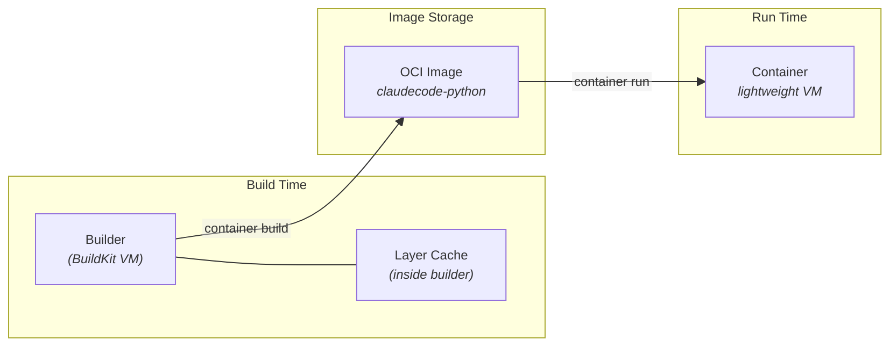
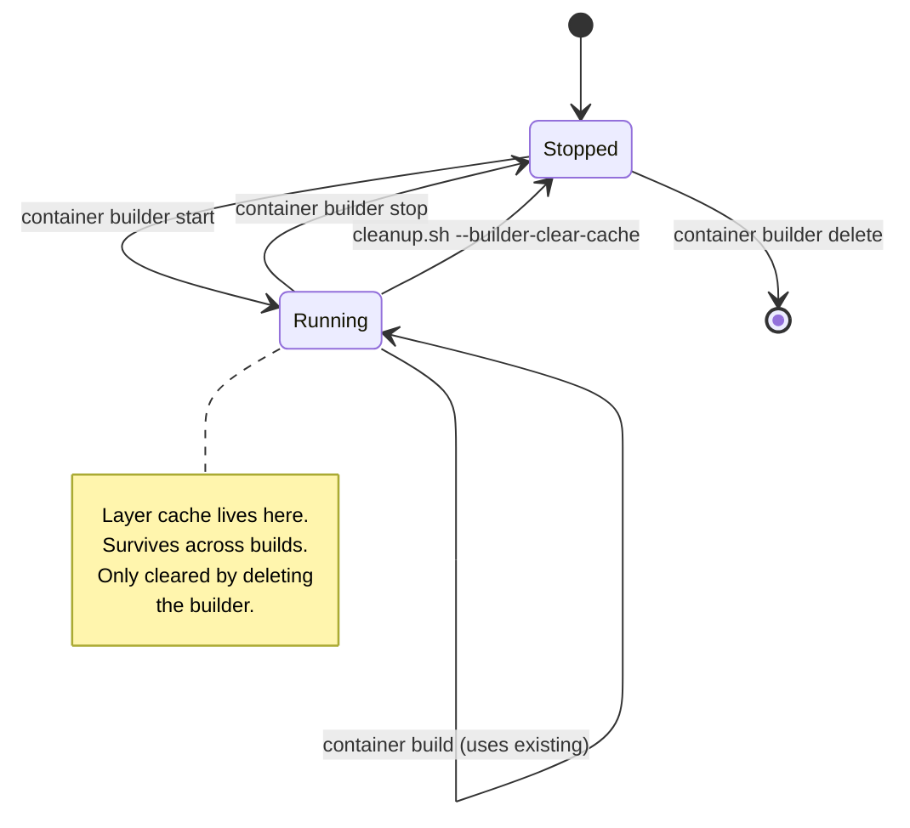
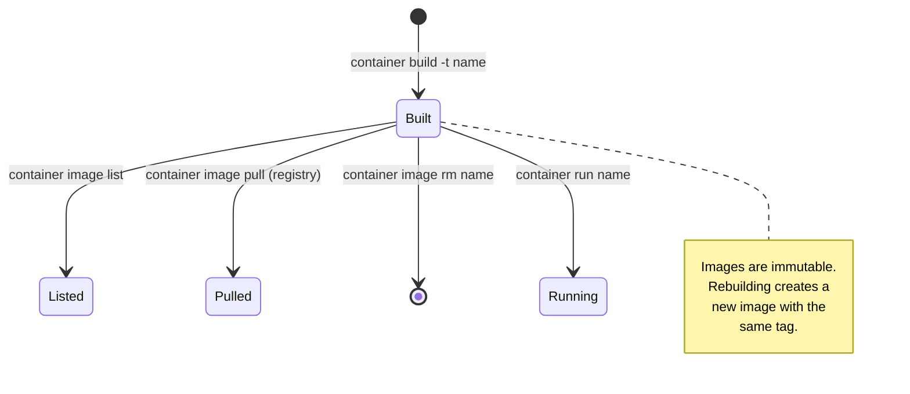
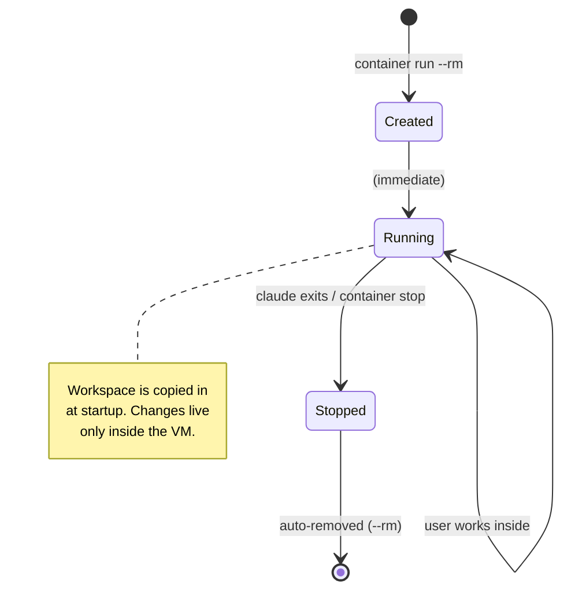
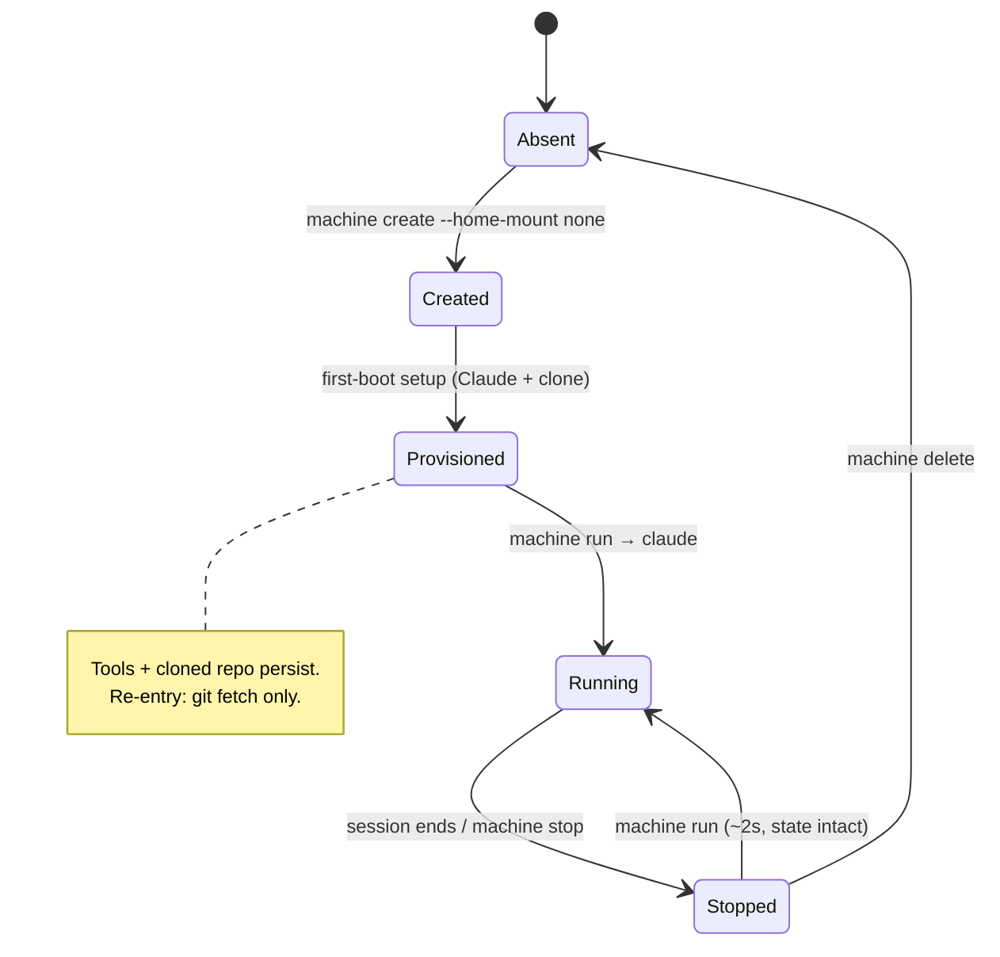
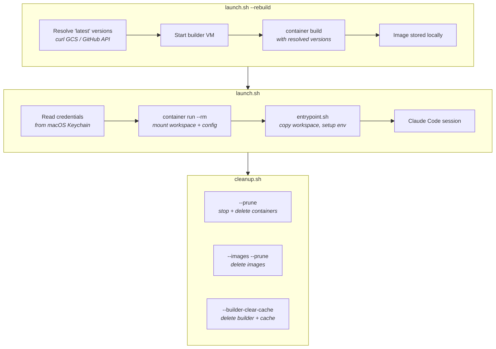
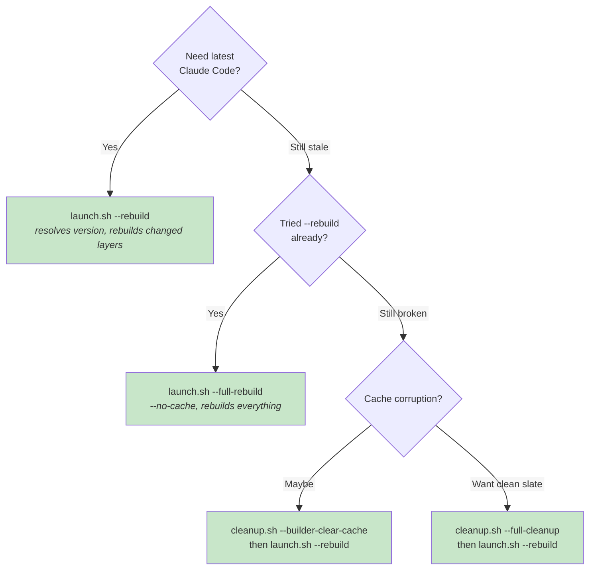

# Container, Image, and Builder Lifecycle

Understanding how containers, images, and the builder interact — and what gets cached where — is essential for keeping your Claude Code sandbox up to date.

## Overview

Three independent subsystems collaborate when you run `launch.sh` (ephemeral mode) or `machine-launch.sh` (machine mode):

Each subsystem has its own lifecycle. Removing an image does **not** clear the builder cache, and stopping a container does **not** affect images.

## The Builder

The builder is a utility container running [BuildKit](https://github.com/moby/buildkit) inside a lightweight VM. It processes `Dockerfile` instructions and produces OCI images.

### Builder layer cache

BuildKit caches every Dockerfile layer by computing a **cache key** from the instruction and its inputs (build-args, source files, base image digest). On subsequent builds:

- **Cache hit** — same cache key → layer is reused instantly (no download, no install)
- **Cache miss** — different cache key → layer is rebuilt, and all subsequent layers are also rebuilt

This is why `container image rm` alone doesn't force a fresh build — the builder is a separate VM with its own cache. Even after deleting all images, running `container build` will still find cached layers in the builder.

### The "latest" problem

When a build-arg like `CLAUDE_CODE_VERSION=latest` is passed, BuildKit sees the literal string `"latest"` — the same string every time. This produces a cache hit, so the old binary is reused even when a new version exists upstream.

**Solution (`launch.sh --rebuild`):** The script resolves `"latest"` to the actual version number on the host *before* calling `container build`. BuildKit then sees a new cache key (e.g., `1.0.33` → `1.0.34`) and rebuilds the affected layers.

### Builder commands

| Command | What happens |
|---------|-------------|
| `container builder start --cpus N --memory SIZE` | Start the builder VM with given resources |
| `container builder status` | Show builder state |
| `container builder stop` | Stop the builder VM (cache preserved on disk) |
| `container builder delete` | Delete the builder VM **and all cached layers** |
| `cleanup.sh --builder-clear-cache` | Stop + delete (convenience wrapper) |
| `cleanup.sh --builder-restart` | Clear cache + restart with configured resources |

> See also: Apple Container [how-to — configure builder resources](https://github.com/apple/container/blob/main/docs/how-to.md#configure-memory-and-cpus-for-large-builds) and [command reference — builder](https://github.com/apple/container/blob/main/docs/command-reference.md).

## Images

An image is a read-only OCI artifact stored locally. It contains the filesystem layers that a container boots from.

### Image management commands

| Command | What happens |
|---------|-------------|
| `container image list` | List local images |
| `container image list --verbose` | List with sizes |
| `container image rm NAME` | Delete a specific image |
| `cleanup.sh --images` | List claudecode-* images with sizes |
| `cleanup.sh --images --prune` | Delete all claudecode-* images |

> See also: Apple Container [command reference — image](https://github.com/apple/container/blob/main/docs/command-reference.md).

## Containers

Each container is a lightweight VM running a Linux kernel. In this project, containers are ephemeral — they are created with `--rm` and destroyed when Claude Code exits.

### Container management commands

| Command | What happens |
|---------|-------------|
| `container list --all` | List all containers |
| `container stop NAME` | Stop a running container |
| `container delete NAME` | Delete a stopped container |
| `cleanup.sh --list` | List managed containers (claude-*) |
| `cleanup.sh --stop` | Stop all managed containers |
| `cleanup.sh --prune` | Stop + delete all managed containers |

> See also: Apple Container [how-to — configure container resources](https://github.com/apple/container/blob/main/docs/how-to.md#configure-memory-and-cpus-for-your-containers) and [technical overview](https://github.com/apple/container/blob/main/docs/technical-overview.md).

## Machines

Machines are persistent Linux VMs created via `container machine` with `--home-mount none`. Unlike containers, they survive stop/start cycles — tools, cloned repos, and Claude's session state persist. Startup is ~2s after first provisioning.

### Machine management commands

| Command | What happens |
|---------|-------------|
| `container machine list` | List all machines |
| `container machine stop NAME` | Stop a running machine |
| `container machine delete NAME` | Delete a machine (destroys storage) |
| `cleanup.sh --machines` | List managed machines (`claude-machine-*`) |
| `cleanup.sh --machines --stop` | Stop all managed machines |
| `cleanup.sh --machines --remove` | Delete all stopped machines |
| `cleanup.sh --machines --prune` | Stop + delete all managed machines |

> See also: [Machine Mode](machine-mode.md) and [RUNNING.md](../RUNNING.md#machine-mode-machine-launchsh).

## Full Lifecycle: Build → Run → Cleanup

## Rebuild Strategies

| Strategy | Command | When to use |
|----------|---------|-------------|
| **Smart rebuild** | `launch.sh --rebuild` | Regular updates. Resolves "latest" to real versions — cache busts only for changed layers. Fast when nothing changed upstream. |
| **Full rebuild** | `launch.sh --full-rebuild` | Suspect corrupted cache or want a completely fresh image. Passes `--no-cache` to BuildKit — every layer is rebuilt from scratch. |
| **Clear cache + rebuild** | `cleanup.sh --builder-clear-cache` then `launch.sh --rebuild` | Nuclear option. Deletes the entire builder VM and its cache, then does a smart rebuild. Equivalent to a first-time build. |
| **Full cleanup + rebuild** | `cleanup.sh --full-cleanup` then `launch.sh --rebuild` | Start completely fresh — remove all containers, images, and builder cache, then rebuild everything. |

### Which to choose?

## Disk Usage

Use `cleanup.sh --disk-usage` (wraps `container system df`) to see how much space containers, images, and the builder cache are consuming.

> See also: Apple Container [command reference — system](https://github.com/apple/container/blob/main/docs/command-reference.md).

## Reference

- [Apple Container — Technical Overview](https://github.com/apple/container/blob/main/docs/technical-overview.md) — how `container` runs lightweight VMs
- [Apple Container — How-to](https://github.com/apple/container/blob/main/docs/how-to.md) — configure builder/container resources, mounts, networking
- [Apple Container — Command Reference](https://github.com/apple/container/blob/main/docs/command-reference.md) — full CLI documentation
- [RUNNING.md](../RUNNING.md) — building images, running containers, machine mode
- [Machine Mode](machine-mode.md) — persistent isolated containers architecture
- [CONFIGURATION.md](../CONFIGURATION.md) — build config, feature flags, permission modes
- [TROUBLESHOOTING.md](../TROUBLESHOOTING.md) — common errors and fixes
