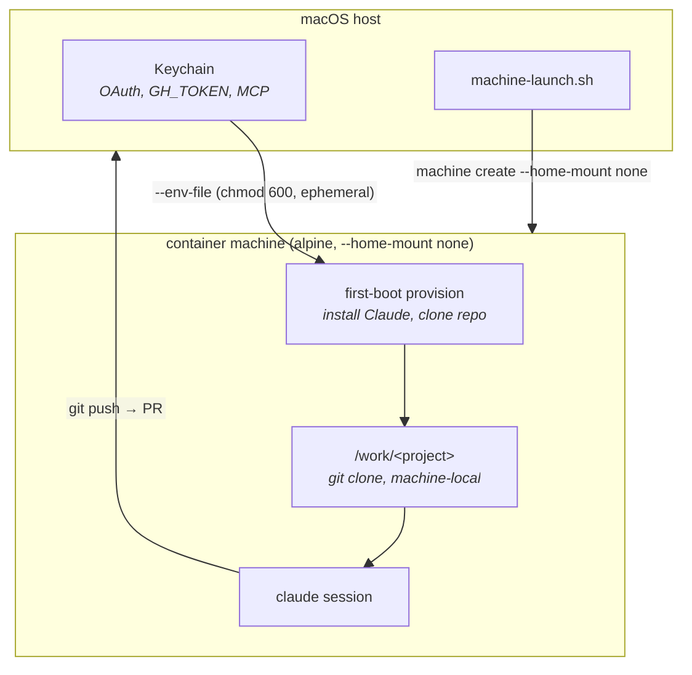
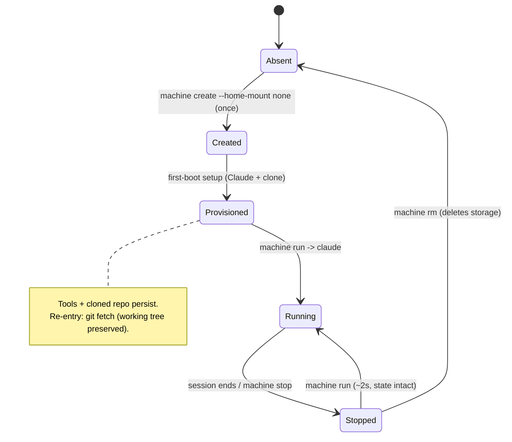

# Machine Mode — Persistent, Isolated Containers

> **Status:** Implemented (`machine-launch.sh`). An *alternative* run mode, not a replacement for ephemeral `launch.sh`.

## Problem

Apple Container 1.0.0 (released 2026-06-09, [PR #1662](https://github.com/apple/container/pull/1662))
added `container machine` — persistent, host-integrated Linux environments. They start in
~2s, keep installed tools and state across restarts, and run an init system (systemd/OpenRC).

That is attractive for running Claude Code: instant startup, no per-session image boot, packages
and MCP registrations survive. **But** the headline feature — automatic host `$HOME` mounting —
directly defeats this project's reason to exist: *isolating Claude from the host filesystem*.
The default machine mounts your real `$HOME` read-write into the VM.

**The question this doc answers:** can we get the persistence + speed of `container machine`
*without* surrendering host isolation? **Yes — via `--home-mount none`.** That choice cascades
into how the repo and credentials get in, which is what this design covers.

## Findings (verified against apple/container source, June 2026)

| Capability | Verdict | Evidence |
|---|---|---|
| `--home-mount none` severs host `$HOME` | ✅ Real & tested | `Sources/ContainerPersistence/MachineConfig.swift`; CLI test creates a machine with `--home-mount none` and asserts exit 0 |
| Values are `ro` / `rw` / `none`, default `rw` | ✅ | `command-reference.md`: `--home-mount <home-mount>` |
| Persistence across stop/start | ✅ | Machine filesystem is durable; only `machine rm` deletes storage |
| Arbitrary `--mount` / `--volume` on machine | ❌ **Not supported** | Neither `machine create` nor `machine run` expose bind/volume flags. `machine create` supports only: `--name`, `--cpus`, `--memory`, `--home-mount`, `--no-boot`, `--set-default`, arch/os/platform. `machine run` adds: `-e`/`--env`, `--env-file`, user/uid/gid, `--workdir`, `--detach`, `--root`. No bind/volume flags on either. |
| `container cp` into a machine | ❌ Not applicable | `container cp` targets *containers* (`name:/path`), a different object class. No evidence it addresses machines. |
| SSH agent socket forwarding | ❌ **Dropped** | Socket path `/var/host-services/ssh-auth.sock` appears in machine tests (`RuntimeService.swift`, `TestCLIMachine.swift`), but those almost certainly ran under default `rw`. Unconfirmed under `--home-mount none`. **Decision:** no SSH support in machine mode — GH_TOKEN/HTTPS covers all git operations. |
| Host user mapping (uid/gid) | ✅ | `machine run` runs as a user matching the host account by default (`--root` to override) |
| Base image must have `/sbin/init` | ✅ | `alpine:latest` works; `debian:bookworm-slim` fails (no init) — confirmed in prior testing |

**The pivotal consequence:** with `--home-mount none` there is **no built-in host→machine
filesystem bridge at all**. So the machine cannot *receive* the repo by mounting — it must
**fetch it itself** (clone) or have it **streamed in** (tar over stdin).

## Design: `--home-mount none` model

This keeps machine mode consistent with the project's isolation guarantee. The host filesystem
is unreachable from the machine; the repo lives only inside the machine; work flows back out as
**git pushes / PRs** (matches established design preference for PR-based change flow).

> **Work-ingress contract changes vs. copy mode — important.** Today's copy mode snapshots the
> *working tree*: uncommitted edits, untracked files, and `.env` are all carried in (RUNNING.md
> lists `.env` under **Kept**). A `git clone` inside the machine brings only
> **committed-and-pushed** history. So under `--home-mount none`:
> - a user with local uncommitted work must **commit + push first**, or it won't be visible inside;
> - **untracked secrets like `.env` do not auto-arrive** — they must be injected via `--env-file`
>   or a deliberate `tar`-in step.
>
> This is a real behavioral divergence, not a detail. Document it prominently in user-facing docs.

**Why GH_TOKEN, not SSH, is the primary git path:** the existing auth bridge (RUNNING.md) already
establishes that git inside our containers uses **GH_TOKEN over HTTPS** with a URL rewrite, because
macOS Secure-Enclave SSH keys don't function in the Linux guest. GH_TOKEN is therefore the
*production-proven* mechanism for both clone and push. SSH is **not supported** in machine mode — macOS Secure-Enclave keys don't work in the Linux guest, and GH_TOKEN/HTTPS covers all git operations.

### Lifecycle

## Knobs

| Knob | Options | Default (proposed) | Notes |
|---|---|---|---|
| `--home-mount` | `rw` / `ro` / `none` | **`none`** | `none` = isolation preserved. `rw` = Apple's "edit on Mac, build inside" (defeats sandbox). |
| Base image | any image with `/sbin/init` | `alpine:latest` | Debian slim lacks init. Custom image only if Alpine packaging proves limiting. |
| Repo ingress | `git clone` / `tar` over stdin | `git clone` over **GH_TOKEN/HTTPS** | Clone on first boot; `git fetch` on re-entry (working tree preserved). |
| Credentials | `--env-file` on `machine run` (GH_TOKEN, OAuth, MCP) | env-file (chmod 600) at first `machine run` | **Not** `machine create` (which has no `--env-file`). Credentials are passed at the provisioning `machine run` call and persisted inside the machine filesystem for subsequent runs. Host-side env-file is ephemeral. **Never** mount Keychain in. `CLAUDE_CODE_OAUTH_TOKEN` (long-lived) eliminates token refresh. |
| Persistence scope | per-project machine / shared | **per-project** (`claude-machine-<slug>`) | Avoids state bleed across projects (shared `$HOME` is exactly what we're avoiding). |
| Idle teardown | TTL reaper / manual | manual `machine stop` | Optional reaper later; machines are cheap when stopped. |

## Implementation

Machine mode is implemented in `machine-launch.sh` (~930 lines). Key implementation details:

- **Entry point:** `machine-launch.sh` — manages the full create-or-reuse lifecycle.
- **Provisioning:** heredoc-based shell script piped to `container machine run --root` with credentials via `--env-file` (chmod 600, ephemeral on host).
- **Sentinel file:** `/var/lib/claude-machine-provisioned` — marks a machine as fully provisioned; re-entry skips provisioning and only runs `git fetch`.
- **Git identity:** extracted from host `git config --global`, with `[machine]` TOML fallback. Hard-fails if neither is available.
- **Repo URL:** derived from `git remote get-url origin`, SSH→HTTPS converted, GH_TOKEN injected for private repos.
- **Claude settings:** `~/.claude/settings.json`, `settings.local.json`, and `.claude.json` are transported into the machine at provision time.
- **MCP registration:** Postgres, remote HTTP servers, and Talk MCP are registered during provisioning via `claude mcp add -s project`.
- **Hooks:** `~/.claude/hooks/` is tar+base64-encoded on the host and extracted inside the machine.
- **Reprovisioning:** `--reprovision` / `--reset` deletes the machine and starts fresh.
- **Status inspection:** `--status` shows machine existence, provisioning state, and current status without launching.
- **Cleanup:** `cleanup.sh --machines` provides list/stop/remove/prune for `claude-machine-*` machines.

## Future work

- **Per-project storage cost.** One machine per project multiplies disk use; document a cleanup cadence via `cleanup.sh`.
- **Optional idle TTL reaper.** Machines are cheap when stopped, but an automated reaper could clean up stale ones.

## Resolved design decisions

All major design questions were resolved through implementation:

~~**Repo update model.**~~ **Resolved:** on re-entry, `git fetch` to update remote refs; leave the working tree untouched. In-progress work is preserved. A fresh clone is never performed — the machine's cloned repo is the long-lived working copy.

~~**Credential refresh on long-lived machines.**~~ **Resolved:** `CLAUDE_CODE_OAUTH_TOKEN` is a long-lived token injected via `--env-file` at machine creation. No re-injection or refresh is needed on subsequent `machine run` invocations. GH_TOKEN is similarly stable. If a token is rotated, `--reprovision` re-injects it.

~~**MCP registration drift.**~~ **Resolved:** MCP servers are registered once during first-boot provisioning. Definitions persist in the machine filesystem and survive stop/start cycles. If the host MCP config changes, the user can `--reprovision` or `cleanup.sh --machines --remove` and recreate.

~~**`SSH_AUTH_SOCK` robustness.**~~ **Resolved — dropped.** No SSH support in machine mode. All git operations use GH_TOKEN over HTTPS. This eliminates socket staleness, forwarding plumbing, and the unconfirmed `--home-mount none` SSH behavior entirely.

## Decision summary

- **`--home-mount none` is the right default for this project** — it's the only machine
  configuration that preserves host isolation, the core reason the project exists. The Apple
  default (`rw`) is a *convenience/dev-loop* posture that this tool deliberately rejects.
- Machine mode is **additive**: ephemeral `launch.sh` stays the default for one-shot, fully
  reproducible sessions; `machine-launch.sh` serves power users wanting instant startup +
  persistent state with isolation intact.
- The defining design constraint is **no host filesystem bridge** under `none`: the machine
  **clones** the repo over forwarded credentials and **pushes** work back out as PRs.
