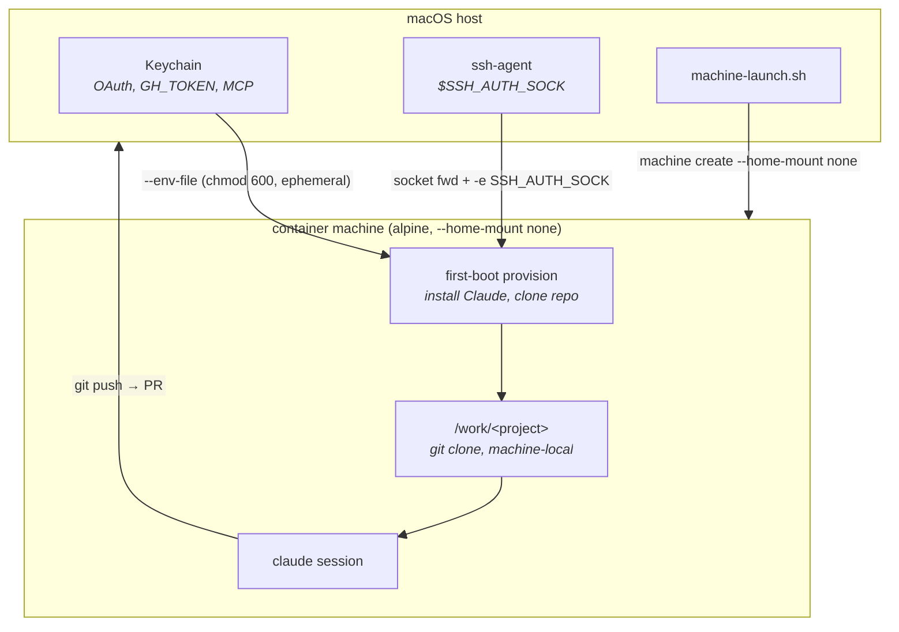
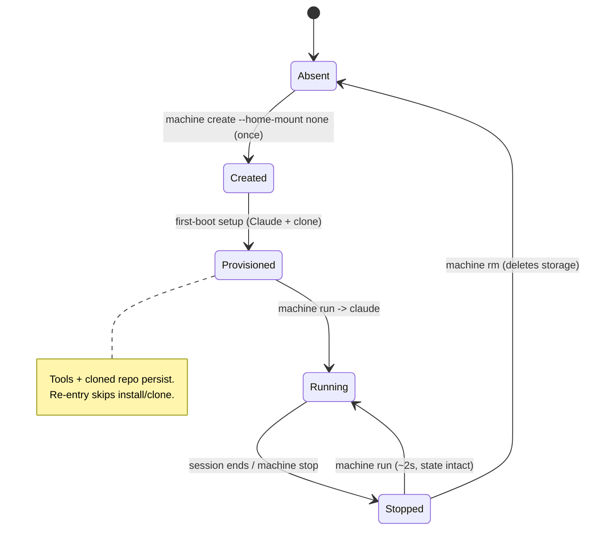

# Machine Mode — Persistent, Isolated Containers (Design)

> **Status:** Design sketch — deferred "next iteration" work. Not yet implemented.
> **Scope:** An *alternative* run mode (`machine-launch.sh`), not a replacement for ephemeral `launch.sh`.

## Problem

Apple Container 1.0.0 (released 2026-06-09, [PR #1662](https://github.com/apple/container/pull/1662))
added `container machine` — persistent, host-integrated Linux environments. They start in
~2s, keep installed tools and state across restarts, and run an init system (systemd/OpenRC).

That is attractive for running Claude Code: instant startup, no per-session image boot, packages
and MCP registrations survive. **But** the headline feature — automatic host `$HOME` mounting —
directly defeats this project's reason to exist: *isolating Claude from the host filesystem*.
The default machine mounts your real `$HOME` read-write into the VM.

**The question this doc answers:** can we get the persistence + speed of `container machine`
*without* surrendering host isolation? **Yes — via `--home-mount none`.** That choice cascades
into how the repo and credentials get in, which is what this design covers.

## Findings (verified against apple/container source, June 2026)

| Capability | Verdict | Evidence |
|---|---|---|
| `--home-mount none` severs host `$HOME` | ✅ Real & tested | `Sources/ContainerPersistence/MachineConfig.swift`; CLI test creates a machine with `--home-mount none` and asserts exit 0 |
| Values are `ro` / `rw` / `none`, default `rw` | ✅ | `command-reference.md`: `--home-mount <home-mount>` |
| Persistence across stop/start | ✅ | Machine filesystem is durable; only `machine rm` deletes storage |
| Arbitrary `--mount` / `--volume` on machine | ❌ **Not supported** | `machine create` and `machine run` expose only: resources, `--home-mount`, `--env`/`--env-file`, user/uid/gid, `--workdir`, `--detach`, `--root`. No bind/volume flags. |
| `container cp` into a machine | ❌ Not applicable | `container cp` targets *containers* (`name:/path`), a different object class. No evidence it addresses machines. |
| SSH agent socket forwarding | ⚠️ Partial | Socket path `/var/host-services/ssh-auth.sock` appears in machine tests (`RuntimeService.swift`, `TestCLIMachine.swift`), but those almost certainly ran under default `rw`. **Unconfirmed under `--home-mount none`.** Also `SSH_AUTH_SOCK` is not auto-exported; must pass `-e`. Treat as nice-to-have, not the primary git path. |
| Host user mapping (uid/gid) | ✅ | `machine run` runs as a user matching the host account by default (`--root` to override) |
| Base image must have `/sbin/init` | ✅ | `alpine:latest` works; `debian:bookworm-slim` fails (no init) — confirmed in prior testing |

**The pivotal consequence:** with `--home-mount none` there is **no built-in host→machine
filesystem bridge at all**. So the machine cannot *receive* the repo by mounting — it must
**fetch it itself** (clone) or have it **streamed in** (tar over stdin).

## Design: `--home-mount none` model

This keeps machine mode consistent with the project's isolation guarantee. The host filesystem
is unreachable from the machine; the repo lives only inside the machine; work flows back out as
**git pushes / PRs** (matches established design preference for PR-based change flow).

> **Work-ingress contract changes vs. copy mode — important.** Today's copy mode snapshots the
> *working tree*: uncommitted edits, untracked files, and `.env` are all carried in (RUNNING.md
> lists `.env` under **Kept**). A `git clone` inside the machine brings only
> **committed-and-pushed** history. So under `--home-mount none`:
> - a user with local uncommitted work must **commit + push first**, or it won't be visible inside;
> - **untracked secrets like `.env` do not auto-arrive** — they must be injected via `--env-file`
>   or a deliberate `tar`-in step.
>
> This is a real behavioral divergence, not a detail. Document it prominently in user-facing docs.

**Why GH_TOKEN, not SSH, is the primary git path:** the existing auth bridge (RUNNING.md) already
establishes that git inside our containers uses **GH_TOKEN over HTTPS** with a URL rewrite, because
macOS Secure-Enclave SSH keys don't function in the Linux guest. GH_TOKEN is therefore the
*production-proven* mechanism for both clone and push. SSH-agent forwarding (above) is an unconfirmed
nice-to-have under `none` and must not be load-bearing in the design.

### Lifecycle

## Knobs

| Knob | Options | Default (proposed) | Notes |
|---|---|---|---|
| `--home-mount` | `rw` / `ro` / `none` | **`none`** | `none` = isolation preserved. `rw` = Apple's "edit on Mac, build inside" (defeats sandbox). |
| Base image | any image with `/sbin/init` | `alpine:latest` | Debian slim lacks init. Custom image only if Alpine packaging proves limiting. |
| Repo ingress | `git clone` / `tar` over stdin | `git clone` over **GH_TOKEN/HTTPS** | Clone over the proven GH_TOKEN path (see below) matches PR-flow philosophy. |
| Credentials | `--env-file` (GH_TOKEN, OAuth, MCP); SSH socket optional | env-file (chmod 600) | Reuse the ephemeral-mode env-file pattern. **Never** mount Keychain in. |
| Persistence scope | per-project machine / shared | **per-project** (`claude-machine-<slug>`) | Avoids state bleed across projects (shared `$HOME` is exactly what we're avoiding). |
| Idle teardown | TTL reaper / manual | manual `machine stop` | Optional reaper later; machines are cheap when stopped. |

## Plan (phased)

### Phase 0 — Spike (no script)
Manually validate the load-bearing assumptions before writing `machine-launch.sh`:
1. `container machine create --home-mount none --name spike alpine:latest`
2. Confirm host `$HOME` is **not** visible inside (`ls /Users` / `ls ~` empty or absent).
3. Install Claude Code inside; confirm it persists across `machine stop` / `machine run`.
4. `git clone` a private repo using `GH_TOKEN`/HTTPS passed via `--env-file`; confirm success.
5. Confirm a `git push` from inside reaches the remote **using GH_TOKEN alone** (no SSH). This is
   the load-bearing path — it must work independently of the SSH socket.
6. *(Optional, lower priority)* Probe SSH forwarding under `none`: pass
   `-e SSH_AUTH_SOCK=/var/host-services/ssh-auth.sock` and test git over SSH. Informational only —
   the design does not depend on this succeeding.

**Exit criterion:** all six pass → the `none` model is viable. Any failure reshapes the design.

### Phase 1 — `machine-launch.sh` MVP
- Reuse from `launch.sh`: symlink-safe `SCRIPT_DIR`, layered config resolution, Keychain
  credential extraction, the `--env-file` (chmod 600) credential pattern.
- Machine naming: `claude-machine-<project-slug>`.
- **create-or-reuse:** if the machine exists, `machine run` into it; else `machine create
  --home-mount none` then provision.
- **First-boot provision** (idempotent): install Claude Code + tools; `git clone` the project
  into `/work/<slug>` (or `git fetch` if already present); register MCP servers; render
  `CONTAINER.md`. Mark completion with a sentinel file so re-entry is fast.
- `exec claude [flags]` as the mapped host user.

### Phase 2 — Credential & MCP parity
- Mirror ephemeral mode: OAuth, GH_TOKEN (+ git HTTPS rewrite), MCP tokens, timezone.
- Decide credential refresh strategy: env-file is injected per `machine run`, so rotated tokens
  flow in on next entry — verify OAuth refresh survives a stopped machine.
- SSH agent: export `SSH_AUTH_SOCK` explicitly (not auto-set in machines).

### Phase 3 — Lifecycle integration
- Extend `cleanup.sh` with a machine class: list/stop/rm `claude-machine-*` (distinct from
  ephemeral `claude-*` containers).
- Optional idle TTL reaper.
- Docs: a "Machine mode vs ephemeral mode" comparison in RUNNING.md.

## Open questions

- **Repo update model.** On re-entry: `git fetch` + leave working tree to the user, or
  reset to a fresh clone? Persistent working tree can drift; a fresh clone loses in-progress work.
- **Credential refresh on long-lived machines.** OAuth tokens expire; confirm re-injection via
  `--env-file` on each `machine run` is sufficient, or whether a refresh step is needed.
- **MCP registration drift.** Registrations persist in the machine — how to update when the host
  config changes? Re-run registration on every entry (idempotent) vs. only on first boot.
- **Per-project storage cost.** One machine per project multiplies disk use; document a cleanup
  cadence via `cleanup.sh`.
- **`SSH_AUTH_SOCK` robustness.** Apple's `--ssh` convenience (auto-retarget on re-login) is a
  *container run* feature; confirm the equivalent is needed/available for machines or handle
  socket staleness manually.

## Decision summary

- **`--home-mount none` is the right default for this project** — it's the only machine
  configuration that preserves host isolation, the core reason the project exists. The Apple
  default (`rw`) is a *convenience/dev-loop* posture that this tool deliberately rejects.
- Machine mode is **additive**: ephemeral `launch.sh` stays the default for one-shot, fully
  reproducible sessions; `machine-launch.sh` serves power users wanting instant startup +
  persistent state with isolation intact.
- The defining design constraint is **no host filesystem bridge** under `none`: the machine
  **clones** the repo over forwarded credentials and **pushes** work back out as PRs.
